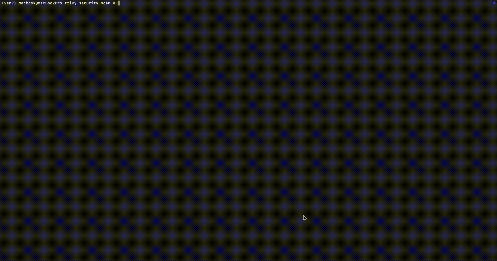

# 🐳 Flask App Container Security Scan with Trivy

This project demonstrates how to containerize a simple Python Flask web application and scan the Docker image for vulnerabilities using [Trivy](https://github.com/aquasecurity/trivy). It shows how using secure base images and proper dependency pinning can reduce security risks in containerized applications.

---

## 🛠 Tech Stack

- Python 3.8
- Flask
- Docker
- Trivy (by Aqua Security)

---

## 📁 Project Structure

```bash
├── app.py # Flask web application
├── Dockerfile # Docker build instructions
├── trivy-report.json # JSON output of Trivy scan
├── trivy-report.txt #  Table output of Trivy scan
└── README.md # Project documentation
```
yaml
Copy
Edit

---

## 🚀 Getting Started

### 1. Clone the repository

```bash
git clone https://github.com/your-username/flask-trivy-security-scan.git
cd flask-trivy-security-scan
```
---

### 2. Build the Docker Image
```bash
docker build -t flask-insecure-app .
```
  

---
### 3. Run the Flask App
```bash
docker run -p 5050:5050 flask-insecure-app
Visit http://localhost:5050 in your browser to verify it works.
```
---
## 🔍 Scan with Trivy
Install Trivy (macOS with Homebrew)
```bash
brew install aquasecurity/trivy/trivy
```
### Run a Security Scan
```bash

trivy image --format json --output trivy-report.json flask-insecure-app
```

### You can also output in table format:

```bash
trivy image --format table --output trivy-report.txt flask-insecure-app
```
## 🧪 Secure Version
To reduce vulnerabilities:

Switch to a more secure base image: python:3.8-slim-buster

Pin the Flask version in Dockerfile: flask==2.2.5

### Rebuild and scan again:

```bash

docker build -t flask-secure-app .
trivy image flask-secure-app
```
# 📊 Before & After: Trivy Scan Comparison
| Image Tag |	Critical | Vulnerabilities	| Fixes Applied |
|---------------------|----------------------|------------------------|--------------------------|
flask-insecure-app |	✅ High & Medium |	Unpinned packages,| insecure base
flask-secure-app |	✅ Reduced significantly |	Pinned Flask + | secure base image

## 📌 What I Learned
How to build and containerize a Flask app

How to identify vulnerabilities in container images using Trivy

The importance of base image choice and dependency management in secure DevOps

# 👨‍💻 Author
Onuora Adiorah
📍 Bloomfield, NJ
📫 adiorahonuora@gmail.com
🔗 LinkedIn

📄 License
This project is licensed under the MIT License.
